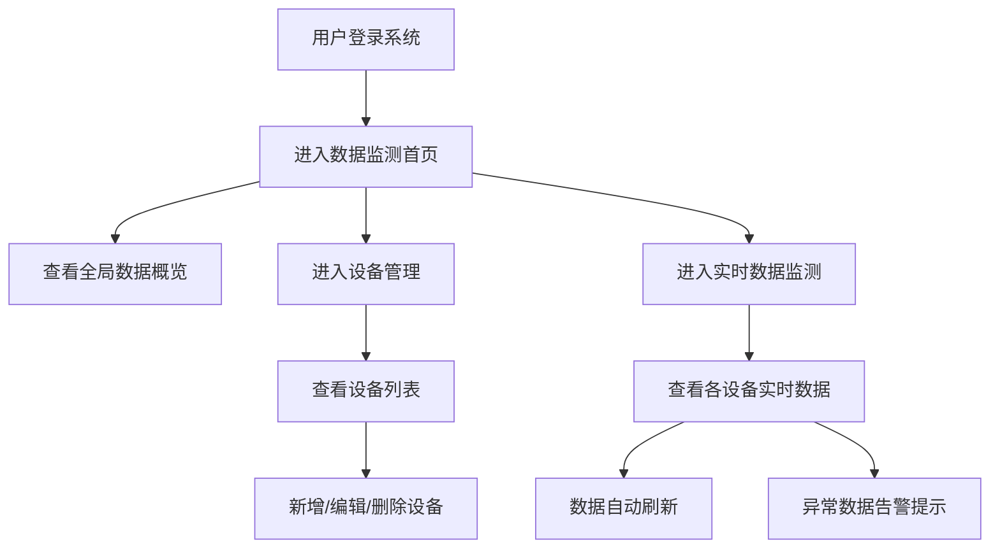

## 1. 产品概述

扬尘监测系统是一套面向环保监管部门、施工单位和工业企业的Web端环境监测平台，用于实时监测和管理空气中的扬尘污染数据（PM2.5、PM10）及噪音水平。系统通过部署在各监测点的设备采集数据，并在Web端集中展示和管理，帮助用户及时掌握环境质量状况，实现对扬尘污染的有效监管。

## 2. 核心功能

### 2.1 用户角色

| 角色 | 注册方式 | 核心权限 |
|------|----------|----------|
| 系统管理员 | 系统预置 | 设备全生命周期管理、数据监测查看、系统配置 |
| 普通用户 | 管理员创建 | 数据监测查看、设备状态浏览 |

### 2.2 功能模块

1. **数据监测首页（Dashboard）**：全局数据概览、实时数据展示、区域数据统计
2. **设备管理模块**：设备列表展示、新增设备、设备编辑、设备详情、设备删除
3. **实时数据监测**：各设备实时数据展示、数据刷新、异常告警提示

### 2.3 页面详情

| 页面名称 | 模块名称 | 功能描述 |
|-----------|-------------|---------------------|
| 数据监测首页 | 数据概览卡片 | 展示设备总数、在线设备数、平均PM2.5、平均PM10、平均噪音等核心指标 |
| 数据监测首页 | 区域数据分布 | 按区域分类展示各区域的环境数据统计 |
| 数据监测首页 | 实时数据列表 | 滚动展示所有设备的最新监测数据及状态 |
| 设备管理 | 设备列表 | 以表格形式展示所有设备，支持搜索、筛选、分页 |
| 设备管理 | 新增设备 | 弹窗表单录入设备信息：名称、编号、安装位置、所属区域、监测参数配置、网络连接信息 |
| 设备管理 | 设备详情 | 查看设备完整信息及历史数据趋势 |
| 实时数据监测 | 设备数据卡片 | 每个设备独立卡片展示PM2.5、PM10、噪音实时数值及状态指示灯 |
| 实时数据监测 | 数据刷新 | 支持手动刷新和自动定时刷新功能 |

## 3. 核心流程

**设备管理流程**：用户进入设备管理页面 → 点击"新增设备"按钮 → 填写设备基本信息（名称、编号、位置、区域）→ 配置监测参数（PM2.5阈值、PM10阈值、噪音阈值）→ 配置网络连接信息（IP地址、端口号、通信协议）→ 提交保存 → 设备出现在设备列表中

**数据监测流程**：用户登录系统 → 进入数据监测首页或实时数据监测页面 → 系统自动加载所有设备最新数据 → 展示实时数值及状态 → 数据定时自动刷新（每5秒）或用户手动刷新 → 异常数据高亮显示并触发告警提示

## 4. 用户界面设计

### 4.1 设计风格
- **主色调**：科技蓝（#165DFF）作为主色，搭配深灰（#1D2129）作为背景色，营造专业、科技感的工业监测系统氛围
- **辅助色**：绿色（#00B42A）表示正常、黄色（#FF7D00）表示警告、红色（#F53F3F）表示异常
- **按钮风格**：圆角矩形按钮，4px圆角，带hover状态反馈
- **字体**：使用现代无衬线字体，标题使用粗体，正文使用常规字重
- **布局风格**：侧边栏导航 + 顶部工具栏 + 主内容区的经典后台管理布局，采用卡片式容器展示数据
- **图标风格**：使用Lucide图标库，线性风格图标

### 4.2 页面设计概览

| 页面名称 | 模块名称 | UI元素 |
|-----------|-------------|-------------|
| 数据监测首页 | 数据概览卡片 | 深色背景卡片、大字号数值显示、状态颜色标识、轻微阴影效果 |
| 数据监测首页 | 区域数据分布 | 水平条形图展示、渐变色填充、数值标签 |
| 数据监测首页 | 实时数据列表 | 斑马纹表格、状态指示灯、滚动动画 |
| 设备管理 | 设备列表 | 数据表格、搜索框、筛选下拉、操作按钮、分页组件 |
| 设备管理 | 新增设备弹窗 | 模态弹窗、分组表单、标签页（基本信息/监测参数/网络配置）、表单验证 |
| 实时数据监测 | 设备数据卡片 | 网格布局卡片、彩色进度条、实时数值跳动动画、状态徽章 |

### 4.3 响应式设计
- 采用桌面优先（Desktop-first）设计，主要面向1920×1080及以上分辨率的桌面显示器
- 在平板设备（≥768px）上保持主要布局，适当缩小间距和字号
- 侧边栏在小屏幕设备上可折叠收起
