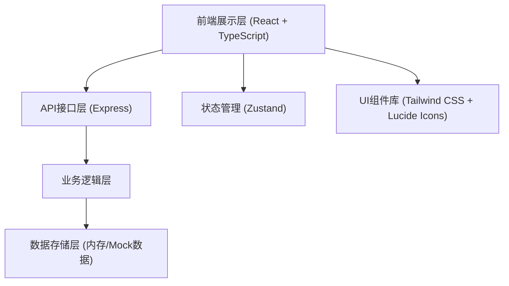
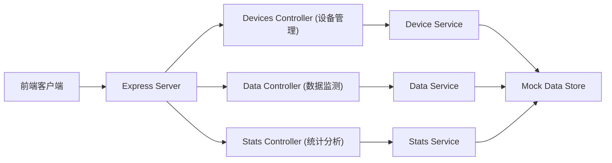
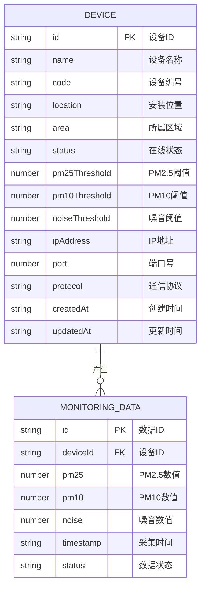

## 1. 架构设计



## 2. 技术描述

- **前端**：React@18 + TypeScript + Tailwind CSS@3 + Vite
- **状态管理**：Zustand
- **路由**：React Router DOM
- **图标**：Lucide React
- **后端**：Express@4 + TypeScript
- **初始化工具**：vite-init
- **数据库**：使用内存数据存储 + Mock数据（模拟真实扬尘监测设备数据）

## 3. 路由定义

| 路由 | 用途 |
|-------|---------|
| /dashboard | 数据监测首页 - 全局数据概览、区域统计、实时数据列表 |
| /devices | 设备管理 - 设备列表展示、搜索、筛选 |
| /devices/:id | 设备详情 - 单个设备信息及历史数据 |
| /realtime | 实时数据监测 - 各设备实时数据卡片展示 |

## 4. API 定义

```typescript
// 设备信息类型
interface Device {
  id: string;
  name: string;
  code: string;
  location: string;
  area: string;
  status: 'online' | 'offline' | 'warning';
  pm25Threshold: number;
  pm10Threshold: number;
  noiseThreshold: number;
  ipAddress: string;
  port: number;
  protocol: 'MQTT' | 'HTTP' | 'Modbus';
  createdAt: string;
  updatedAt: string;
}

// 实时监测数据类型
interface MonitoringData {
  deviceId: string;
  deviceName: string;
  pm25: number;
  pm10: number;
  noise: number;
  timestamp: string;
  status: 'normal' | 'warning' | 'danger';
}

// 区域统计数据
interface AreaStats {
  area: string;
  deviceCount: number;
  avgPm25: number;
  avgPm10: number;
  avgNoise: number;
}

// API 接口列表
// GET /api/devices - 获取设备列表（支持搜索、筛选、分页）
// GET /api/devices/:id - 获取单个设备详情
// POST /api/devices - 新增设备
// PUT /api/devices/:id - 更新设备信息
// DELETE /api/devices/:id - 删除设备
// GET /api/data/realtime - 获取所有设备实时监测数据
// GET /api/data/realtime/:deviceId - 获取单个设备实时数据
// GET /api/stats/overview - 获取全局数据概览
// GET /api/stats/area - 获取各区域统计数据
```

## 5. 服务器架构图



## 6. 数据模型

### 6.1 数据模型定义



### 6.2 初始Mock数据

系统预置以下初始数据用于演示：
- 6台监测设备，分布在3个区域（东区、西区、南区）
- 每台设备配置不同的监测阈值
- 模拟实时监测数据，数据每5秒自动更新一次
- 包含正常、警告、异常三种数据状态
